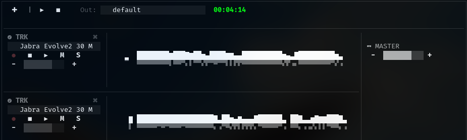

# Tuidio - Almost a DAW (Not even close)

A (very) simple TUI-based DAW-like in Python.

Currently, it only allows you to record multiple tracks (multi-tracking) via the terminal interface.

## Installation

1. Clone this repository:
   ```bash
   git clone <repo-url>
   cd tuidio
   ```
2. (Recommended) Create a virtual environment:
   ```bash
   python3 -m venv .venv
   source .venv/bin/activate
   ```
3. Install dependencies:
   ```bash
   pip install -r requirements.txt
   ```

## How to Run

Run the main application:

```bash
python tuidio.py
```

## Requirements

- Python 3.10+
- Linux (for best compatibility)
- Microphone and speakers

## Features

- Record multiple tracks via terminal interface
- Simple TUI (Text User Interface)

## License

MIT

## Screenshot



---

Tuidio = TUI + Audio or TUI + Studio you decide hehe
